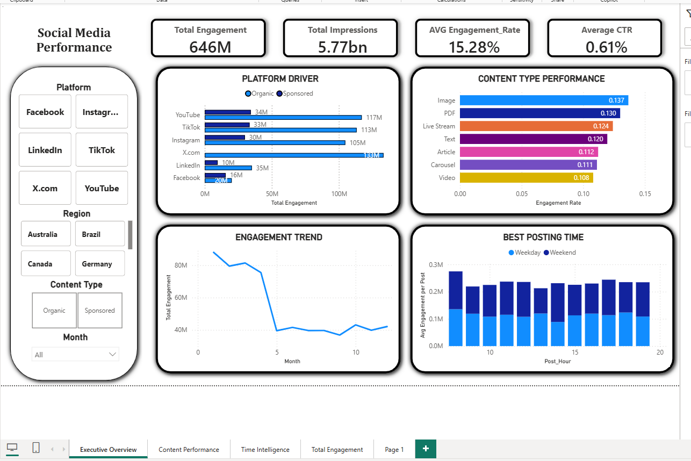

1) Project Title

Social Media Marketing Performance Analytics (2024)
Cross-platform content performance analysis across TikTok, Instagram, LinkedIn, X.com, YouTube, and Facebook.

2) Executive Summary 

This project analyzes post-level performance data across multiple social platforms to identify the content formats, categories, hashtags, and posting windows that drive the best results. I built a full analytics workflow (Python EDA + SQL analysis + Power BI dashboard) to quantify performance drivers by platform and region, and to translate insights into actionable publishing recommendations. A key challenge was incomplete click/CTR tracking; therefore, CTR insights are reported as Tracked Only and accompanied by Tracking Coverage to ensure metric reliability.

3) Business Problem

A global IT company runs content campaigns across multiple platforms and regions. The business needs to answer:

● Which platforms and post types generate the highest engagement or views?

● Which content categories (e.g., product promotion, education) perform best in different regions?

● How do performance metrics vary depending on the platform, post format, or hashtag usage?

● What are the ideal days and times to post content for maximum engagement?

● Are there regional differences in engagement performance and click-through rate (CTR)?

● Which hashtags are most effective in increasing impressions or clicks?

● Which countries or regions consistently have high video views or significant interest in live streaming?

● Is there a correlation between engagement levels and content category or posting time?

● How do organic content differ from promoted content in terms of reach and performance?

4) Data & Scope

Timeframe: 2024 (post-level records)

Platforms: TikTok, Instagram, LinkedIn, X.com, YouTube, Facebook

Key fields: platform, post type/format, content category, post time (day/hour), region, hashtags, impressions, views, engagement, clicks, CTR

Data quality note: CTR/Clicks are not available for all posts → CTR is calculated as Tracked Only; report includes Tracking Coverage %.

5) KPI Framework (what I measured)

Awareness

Total Impressions, Total Views

Engagement

Total Engagement, Avg Engagement Rate

Engagement per 1K Impressions (efficiency metric to compare fairly)

Conversion (Tracked Only)

Total Clicks (where available)

Avg CTR (Tracked Only)

Tracking Coverage %

6) Approach & Methods 

Phase 1 — Python (EDA & Cleaning)

Data profiling, missing values, type normalization

Feature engineering (day name, hour, month, engagement-level buckets)

Exported cleaned dataset for downstream SQL/BI

Phase 2 — SQL (Business Analysis)

Aggregations by platform, post type, content category, region

Time analysis by day/hour

Hashtag performance (impressions/clicks)

Organic vs Sponsored comparisons

Phase 3 — Power BI

Star-schema model (fact + date/platform/region/content dimensions)

Measures for totals, rates, tracked-only CTR, and efficiency metrics

Dashboard pages: Executive Overview, Content Performance, Time Intelligence

7) Key Insights (write these as bullets in README)

Use these as “insight headlines” aligned with your pages:

Executive Overview

Performance differs meaningfully by platform: some platforms deliver higher total reach while others deliver stronger engagement efficiency.

Organic vs Sponsored show different strengths: sponsored content typically scales reach/volume; organic content can remain competitive on engagement efficiency.

Content Performance Deep Dive

Post format matters: certain formats (e.g., video/image/PDF depending on platform) consistently outperform others on engagement rate and/or reach.

Content category efficiency varies: using Engagement per 1K Impressions reveals which categories truly generate interaction per unit of exposure.

Hashtag impact is measurable: top hashtags driving impressions are not always the same ones driving clicks; conversion-focused hashtags should be evaluated with Tracking Coverage + Tracked CTR.

Time Intelligence

Posting performance is not uniform across the week/day. Heatmap analysis highlights the most efficient posting windows by day and hour.

Platform-specific hourly patterns differ, supporting differentiated scheduling rather than a single global posting time.

Regional conversion intent differs: CTR (Tracked Only) varies by region, informing where to prioritize CTA-driven posts and paid distribution.

Video vs Live interest differs by region, suggesting regional tailoring of format strategy.

8) Recommendations 

Adopt platform-specific content playbooks
Prioritize the top-performing post formats per platform (based on engagement efficiency, not only volume).

Allocate content categories by efficiency
Increase publishing share for categories with the highest Engagement per 1K Impressions, and redesign low-efficiency categories before scaling.

Implement a scheduling strategy driven by heatmap peaks
Use peak day/hour windows as default publishing slots; customize by platform using hourly small multiples.

Prioritize CTA content and tracking in high-intent regions
Regions with higher Tracked CTR should receive more conversion-optimized creatives and stronger CTAs.

Standardize link tracking to increase coverage
Improve Tracking Coverage by enforcing UTM/link standards. This makes CTR insights statistically reliable and improves ROI measurement.

9) Limitations & Next Steps 

Limitations

CTR/Clicks are incomplete → CTR is reported as Tracked Only and should be interpreted alongside Tracking Coverage %.

Some comparisons can be biased by content volume; efficiency metrics (Eng/1K) mitigate but do not fully replace controlled experimentation.

Next Steps

Add A/B tests for posting windows and CTAs (by platform and region)

Build a “paid vs organic lift” analysis if spend data becomes available

Create a forecasting model for engagement by schedule/content mix

